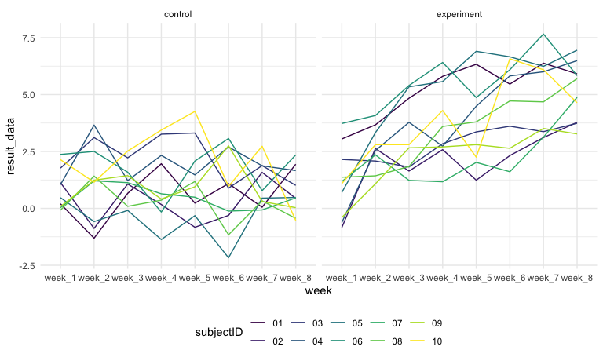

p8105\_hw5\_yl4928
================
Rachel
11/16/2021

## Problem 1

Raw data

``` r
homicideraw_df = read_csv("./homicide-data.csv")
```

\#\#Describe the raw data

The `homicideraw_df` dataset contains 52179 observations and 12
variables.

Read in the data.

``` r
homicide_df = 
  read_csv("./homicide-data.csv") %>% 
  mutate(
    city_state = str_c(city, state, sep = "_"),
    resolved = case_when(
      disposition == "Closed without arrest" ~ "unsolved",
      disposition == "Open/No arrest"        ~ "unsolved",
      disposition == "Closed by arrest"      ~ "solved",
    )
  ) %>% 
  select(city_state, resolved) %>% 
  filter(city_state != "Tulsa_AL")
```

# Describe the raw data

``` r
aggregate_df = 
  homicide_df %>% 
  group_by(city_state) %>% 
  summarize(
    hom_total = n(),
    hom_unsolved = sum(resolved == "unsolved")
  )
```

Can I do a prop test for a single city?

``` r
prop.test(
  aggregate_df %>% filter(city_state == "Baltimore_MD") %>% pull(hom_unsolved), 
  aggregate_df %>% filter(city_state == "Baltimore_MD") %>% pull(hom_total)) %>% 
  broom::tidy()
```

    ## # A tibble: 1 × 8
    ##   estimate statistic  p.value parameter conf.low conf.high method    alternative
    ##      <dbl>     <dbl>    <dbl>     <int>    <dbl>     <dbl> <chr>     <chr>      
    ## 1    0.646      239. 6.46e-54         1    0.628     0.663 1-sample… two.sided

Try to iterate ……..

``` r
results_df = 
  aggregate_df %>% 
  mutate(
    prop_tests = map2(.x = hom_unsolved, .y = hom_total, ~prop.test(x = .x, n = .y)),
    tidy_tests = map(.x = prop_tests, ~broom::tidy(.x))
  ) %>% 
  select(-prop_tests) %>% 
  unnest(tidy_tests) %>% 
  select(city_state, estimate, conf.low, conf.high)
```

``` r
results_df %>% 
  mutate(city_state = fct_reorder(city_state, estimate)) %>% 
  ggplot(aes(x = city_state, y = estimate)) +
  geom_point() + 
  geom_errorbar(aes(ymin = conf.low, ymax = conf.high)) + 
  theme(axis.text.x = element_text(angle = 90, vjust = 0.5, hjust = 1))
```


``` r
city_prop_test = function(df) {
  
  n_unsovled
  n_total
  
  prop.test(.....)
  
}
homicide_df = 
  read_csv("./homicide-data.csv") %>% 
  mutate(
    city_state = str_c(city, state, sep = "_"),
    resolved = case_when(
      disposition == "Closed without arrest" ~ "unsolved",
      disposition == "Open/No arrest"        ~ "unsolved",
      disposition == "Closed by arrest"      ~ "solved",
    )
  ) %>% 
  select(city_state, resolved) %>% 
  filter(city_state != "Tulsa_AL") %>% 
  nest(data = resolved)
```

    ## Rows: 52179 Columns: 12

    ## ── Column specification ────────────────────────────────────────────────────────
    ## Delimiter: ","
    ## chr (9): uid, victim_last, victim_first, victim_race, victim_age, victim_sex...
    ## dbl (3): reported_date, lat, lon

    ## 
    ## ℹ Use `spec()` to retrieve the full column specification for this data.
    ## ℹ Specify the column types or set `show_col_types = FALSE` to quiet this message.

## Problem 2

Create a tidy dataframe containing data from all participants, including
the subject ID, arm, and observations over time:

# 2.1 Start with a dataframe containing all file names

# 2.2 Iterate over file names and read in data for each subject using purrr::map and saving the result as a new variable in the dataframe

# 2.3 Tidy the result; manipulate file names to include control arm and subject ID, make sure weekly observations are “tidy”, and do any other tidying that’s necessary

``` r
allnames_df = tibble(files = list.files("./data"))
```

``` r
path_df = 
  allnames_df %>% 
  tibble(
    path = list.files("./data"),
  ) %>% 
  mutate(
    path = str_c("data/", path),
    data = map(path, read_csv)
  )
```

``` r
tidy_path_df = 
  path_df %>%
  separate(files, into = c("arm", "subjectID")) %>% 
  select(arm, subjectID, data) %>% 
  unnest(data) %>% 
  pivot_longer(
    week_1:week_8,
    names_to = "week",
    values_to = "result_data"
  )
```

    ## Warning: Expected 2 pieces. Additional pieces discarded in 20 rows [1, 2, 3, 4,
    ## 5, 6, 7, 8, 9, 10, 11, 12, 13, 14, 15, 16, 17, 18, 19, 20].

## Make a spaghetti plot showing observations on each subject over time, and comment on differences between groups.

``` r
tidy_path_df %>% 
  mutate(
    arm = recode(
      arm, 
      con = "control",
      exp = "experiment"
    )
  ) %>% 
ggplot(aes(x = week, y = result_data, group = subjectID, color = subjectID)) + 
  geom_line() + 
  facet_grid(.~arm) 
```



## Problem 3

``` r
library(tidyverse)

set.seed(10)

iris_with_missing = iris %>% 
  map_df(~replace(.x, sample(1:150, 20), NA)) %>%
  mutate(Species = as.character(Species))
```

Fill in the missing values \# Write a function

``` r
fill_in = function(x) {
 if (is.numeric(x)) {
   x = ifelse(is.na(x),
 mean(x, na.rm = TRUE), x)}
  
 else{x = ifelse(is.na(x), "virginica", x)}
}
```

## Apply the function

``` r
output = map(iris_with_missing, fill_in)

bind_rows(output)
```

    ## # A tibble: 150 × 5
    ##    Sepal.Length Sepal.Width Petal.Length Petal.Width Species
    ##           <dbl>       <dbl>        <dbl>       <dbl> <chr>  
    ##  1         5.1          3.5         1.4         0.2  setosa 
    ##  2         4.9          3           1.4         0.2  setosa 
    ##  3         4.7          3.2         1.3         0.2  setosa 
    ##  4         4.6          3.1         1.5         1.19 setosa 
    ##  5         5            3.6         1.4         0.2  setosa 
    ##  6         5.4          3.9         1.7         0.4  setosa 
    ##  7         5.82         3.4         1.4         0.3  setosa 
    ##  8         5            3.4         1.5         0.2  setosa 
    ##  9         4.4          2.9         1.4         0.2  setosa 
    ## 10         4.9          3.1         3.77        0.1  setosa 
    ## # … with 140 more rows
